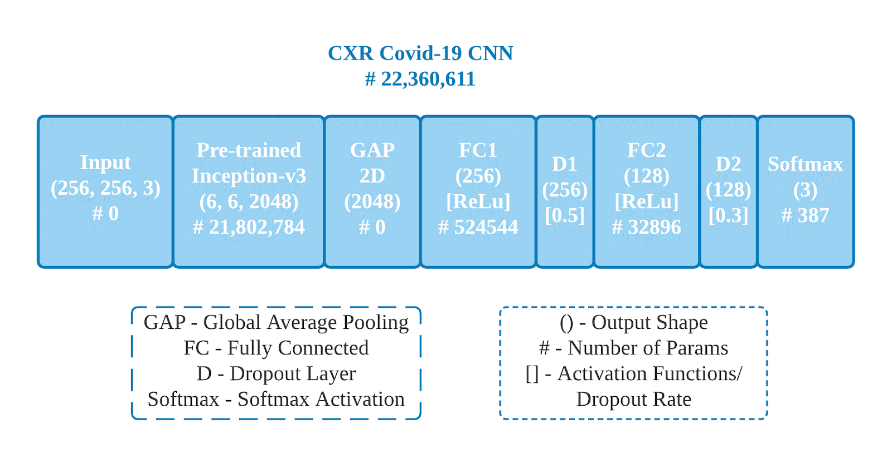
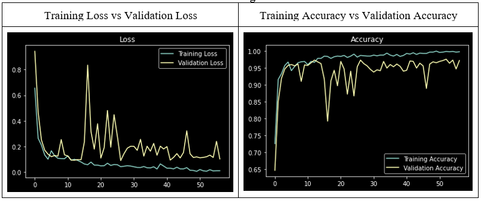

# Assignment of Covid19 Detection in Chest X-rays Image
### Image processing WID3008
### Final Version of Project: covid19-detection-v2-full-result.ipynb

The Covid-19 pandemic is causing a major outbreak in more than 150 countries around the world, having a severe impact on the health and life of many people globally. One of the crucial step in fighting Covid-19 is the ability to detect the infected patients early enough, and put them under special care. Detecting this disease from radiography images is perhaps one of the fastest ways to diagnose the patients. We prepared 3830 Chest X-Rays images to transfer learning on popular state-of-art deep convolutional neural network: Inveption-V3 to identify the existence of Covid-19 disease. Activation map and saliency map also computed to visualize and understand the underlying rules of model decisions. The developed model is further evaluate to analyze the robustness and reliability in real-life classification.

### Dataset

The Covid-19 and Viral Pneumonia classes look pretty similar and hard to differentiate by the human eye. The classification model is needed to be carefully designed in order to tackle the different parts and every useful detail of the image to outperform in the task. Besides, even the data is equally distributed among each class, the overall dataset still considers small for a classification task, thus data augmentation is a vital step for processing the image data before feeding into the training model. 

### Proposed Method and Architecture 

### Model Interpretation (Neural Network Understanding)
The saliency maps are extracted using the CNN classification model trained on the ground truth labels, so no additional annotation is required (such as object bounding boxes or segmentation masks). The computation of the image-specific saliency map for a single class is extremely quick since it only requires a single back-propagation pass. 

### Learning Result

